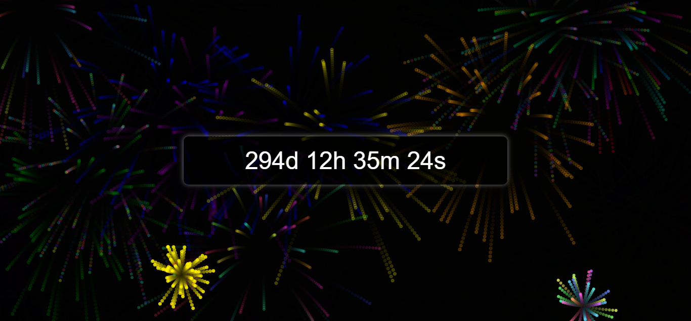

# New Year Countdown with Fireworks Display

This is a web application that displays a beautiful fireworks show with synchronized background music and a countdown timer to the next New Year.

## Features

- **Fireworks Display**: Randomly generated fireworks with various types and colors.
- **Interactive Fireworks**: Click anywhere on the screen to create a firework at that location.
- **Countdown Timer**: A live countdown timer showing the time remaining until the next New Year.
- **Background Music**: Background music that plays automatically and synchronizes with the fireworks display.
- **Responsive Design**: The canvas and countdown timer are responsive and adjust to different screen sizes.
- **Music Control**: If autoplay fails, a button appears to manually start the background music.

## How to Use

1. Open the `index.html` file in a web browser.
2. Enjoy the fireworks display and background music.
3. Click anywhere on the screen to create additional fireworks.
4. Watch the countdown timer to see how much time is left until the next New Year.

## Technologies Used

- HTML
- CSS
- JavaScript

## License

This project is licensed under the MIT License.
